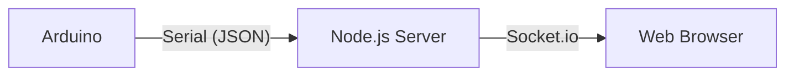

# Joystick Visualizer

Arduinoのジョイスティックモジュールを使用して、Webブラウザ上のオブジェクトを操作するプロジェクト。Arduinoで読み取ったアナログ値をシリアル通信でNode.jsサーバーに送信し、Socket.ioを使用してリアルタイムにブラウザへ反映させる。

## システム構成

全体的なデータの流れは以下の通り。



### コンポーネント詳細

1.  **Arduino (Firmware)**
    *   ジョイスティックのX軸、Y軸のアナログ値 (0-1023) を読み取る。
    *   スイッチのデジタル値 (0 or 1) を読み取る。
    *   読み取ったデータをJSON形式 (`{"x":..., "y":..., "sw":...}`) でシリアルポートに出力する。

2.  **Node.js Server (Backend)**
    *   `serialport` ライブラリを使用してArduinoからのシリアルデータを受信する。
    *   受信したJSONデータをパースする。
    *   `socket.io` を使用して、接続されているWebクライアントにデータをブロードキャスト (`joystick-data` イベント) する。
    *   `public` ディレクトリ内の静的ファイル (Webアプリ) を配信する。

3.  **Web Browser (Frontend)**
    *   Socket.io クライアントを使用してサーバーからデータを受信する。
    *   HTML5 Canvasを使用して、ジョイスティックの入力に応じた描画を行う。
    *   X/Y座標のマッピングを行い、ボールの位置を更新する。
    *   スイッチ入力に応じてボールの色やエフェクトを変化させます。

## ハードウェア構成

### 使用部品
*   Arduino Uno
*   アナログジョイスティックモジュール
*   ジャンパーワイヤ

### 配線

| ジョイスティック | Arduino | 備考 |
| :--- | :--- | :--- |
| GND | GND | - |
| +5V | 5V | - |
| VRx | A0 | X軸アナログ入力 |
| VRy | A1 | Y軸アナログ入力 |
| SW | D2 | スイッチデジタル入力 |


## ソフトウェア設計

### 通信フォーマット

Arduinoから送信されるデータは、以下のJSON形式。

```json
{
  "x": 512,  // X軸の値 (0 - 1023)
  "y": 512,  // Y軸の値 (0 - 1023)
  "sw": 1    // スイッチの状態 (1: OFF, 0: ON - 内部プルアップ使用)
}
```

### ファイル構成

*   `firmware/joystick_controller/joystick_controller.ino`: Arduino用ソースコード
*   `server.js`: Node.js サーバーメインスクリプト
*   `public/index.html`: Webフロントエンド (HTML/JS)
*   `package.json`: Node.js プロジェクト設定

## セットアップと実行

### 1. Arduinoの準備
1.  `firmware/joystick_controller/joystick_controller.ino` をArduino IDE等で開く。
2.  配線通りにArduinoとジョイスティックを接続する。
3.  Arduinoボードにスケッチを書き込む。

### 2. Node.js環境の準備
依存ライブラリをインストールする。

```bash
npm install
```

### 3. 設定の確認
`server.js` を開き、使用するシリアルポート名 (`PORT_NAME`) が正しいか確認 (例: `COM3`, `/dev/ttyUSB0` など)。

```javascript
// server.js
const PORT_NAME = 'COM3'; // ここを環境に合わせて変更
```

### 4. 実行
サーバーを起動。

```bash
node server.js
```

### 5. ブラウザで確認
ブラウザで `http://localhost:3000` にアクセスする。
ジョイスティックを動かすと、画面上のボールが連動して動くことを確認できる。
