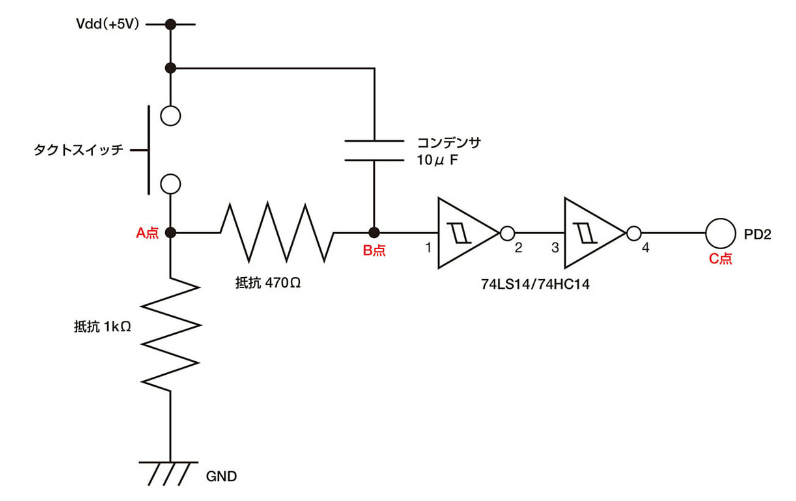
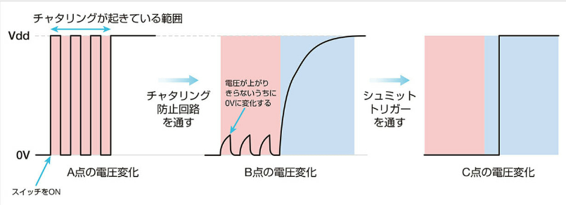

# 2026年 1月 学習ログ

新しい日付を上に見出しとして追加して、自由に記述してください。

## 2026-01-28

### 取り組んだこと
- チャタリング

### 学んだこと・メモ

#### チャタリング
金属板を端子に付ける際、金属板が金属板と接続されるまで、金属板と金属板が接続されている状態になることを**チャタリング**という。チャタリングを回避するには、**プログラムの工夫**と**ハードウェアの工夫**がある。

1. プログラムの工夫
チャタリングはごく短い時間に発生させるので、チャタリングが起こっている間は、一時的に待機させる。
```cpp
if (digitalRead(SWITCH_SOCKET) == 1){
    delay(100);
    count = count + 1;
}
```
2. チャタリング防止回路
待機する時間が長かったりする場合は、チャタリング防止回路をスイッチの出力後に作成しておく。





抵抗は**急激に電荷が流れるのを阻止**する。コンデンサは**電圧の変化を緩やかにする特性**がある。この2つの特性により、チャタリングが発生している部分を影響がない状態にできる。

チャタリングが終わった後は、抵抗とコンデンサの影響で電圧が緩やかにVddになってしまう。そこで、**シュミットトリガー**と呼びICを利用することで出力を0からVddへ急激に切り替えることが可能になる。図の74LS14と74HC14は、インバータが実装されているため、2つ通すことで正しい出力が得られる。

#### 可変抵抗
可変抵抗には、つまみを付けて自由に変化できる**ボリューム**と一度調節したら通常は抵抗値を変えない**半固定抵抗**の2種類がある。
可変抵抗には3つの端子があり、そのうち2つの端子は抵抗素子の両端に接続されている。つまり、両端の端子間は**ボリュームの最大抵抗値**を表す。もう1つの端子は、抵抗素子場を動かせるようになっている。この抵抗素子場を動かすことで、抵抗値を変更することができる。

### 次のステップ

